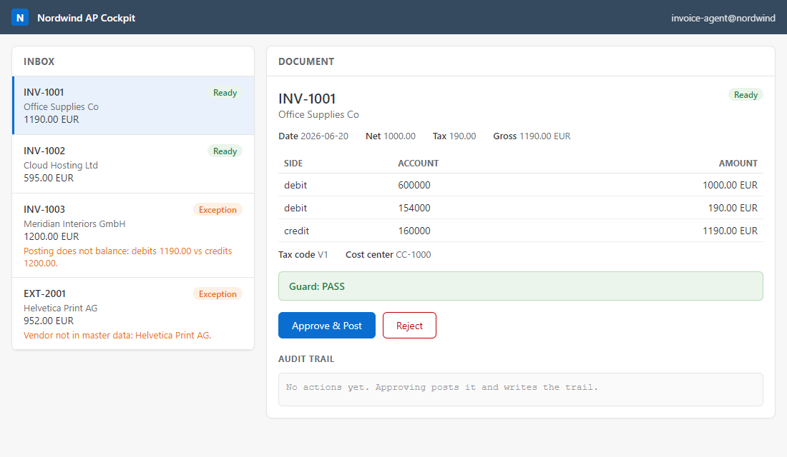

# The operator cockpit

A small, SAP-Fiori-flavored console for the agents. It gives the propose → guard →
approve → log flow a face: an inbox of documents, the agent's proposal, the guard's
verdict, and Approve / Reject / Onboard buttons, with the tamper-evident audit trail
right there.



## Run it

```
python console/serve.py
```

Then open <http://localhost:8000>. No SAP account, no API key, no dependencies, all in
memory. It opens your browser automatically.

## What you can do

- **See the inbox.** Four documents, each with a status: ready, or an exception with
  its reason (a total that does not balance, a vendor not in the master).
- **Read the proposal.** The agent's posting lines, the determined tax code and cost
  center, and the guard's PASS or FAIL with reasons.
- **Approve and post**, or **reject** (nothing is written). Watch the audit trail fill
  in, read → stage → approve → confirm, and the chain report that it is untampered.
- **Onboard a vendor.** For the unknown-vendor exception, one click adds the Business
  Partner to the master and the invoice becomes ready, the way a master-data team
  resolves it.

## How it generalises

Every pattern in this repo shares the same shape, so one console fits them all. The
server talks to a small `InvoicePostingAgent` adapter (inbox, detail, approve, reject,
onboard) wired to Pattern 1. To put another pattern behind the same cockpit, implement
those calls for it and point the server at it. Nothing in the page changes.

Built with the Python standard library only (`http.server`) plus one static HTML page.
