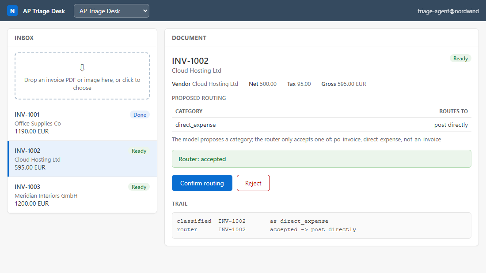

# The operator cockpit

A small, SAP-Fiori-flavored console for the agents. It gives the propose → guard →
approve → log flow a face: an inbox of documents, the agent's proposal, the guard's
verdict, action buttons, and the audit trail right there.

One console, one contract, **all ten** patterns. Switch between them from the picker in
the top bar. Patterns 1 and 2 are wired inline in `serve.py`; Patterns 3 to 10 live in
`extra_agents.py`, one small adapter each:

| Picker | Pattern | Guard verdict shown | Audit chain |
|---|---|---|---|
| Nordwind AP Cockpit | 1 Invoice posting | PASS / FAIL | verifiable |
| AP Triage Desk | 2 Document triage | router accepts / refuses | event trail |
| Three-Way Match Desk | 3 Three-way match | PASS / FAIL | event trail |
| Dispute Copilot | 4 Dispute (suggest-only) | draft ready / refused | event trail |
| Procurement Approvals | 5 Procurement packet | in policy / escalate / blocked | verifiable |
| Close Cockpit | 6 Close orchestration | on track / at risk | event trail |
| Service Resolution Assist | 7 Service resolution | allow / needs-approval / deny | verifiable |
| Cash Application | 8 Cash application | MATCH / PARTIAL / OVERPAID / REJECT | event trail |
| Sales Order Desk | 9 Sales order | PASS / FLAG | verifiable |
| Expense Audit | 10 Expense audit | compliant / violation per line | event trail |

Every adapter drives its pattern's own runnable code with the OFFLINE, deterministic
proposer, so the whole console runs with no OpenRouter key. Patterns 1, 5, 7, and 9
carry a hash-chained audit log and report whether the chain verifies; the rest show a
plainer event trail. Only the invoice-shaped cockpits accept a dropped PDF, so the
console hides the drop tile for the others.




## Run it

```
python console/serve.py
```

Then open <http://localhost:8000>. No SAP account, no API key, no dependencies, all in
memory. It opens your browser automatically.

## What you can do

- **Drop a real invoice.** Drag a PDF or an image onto the tile at the top of the
  inbox (or click to choose one). A vision model reads it into the fields, with a read
  confidence, and it lands in the inbox like any other document. This needs your
  OpenRouter key in a `.env` file (see the Pattern 1 README); without it the drop
  reports that it could not read the file, and the seeded documents still work offline.
- **See the inbox.** Four seeded documents, each with a status: ready, or an exception
  with its reason (a total that does not balance, a vendor not in the master).
- **Read the proposal.** The agent's posting lines, the determined tax code and cost
  center, and the guard's PASS or FAIL with reasons.
- **Approve and post**, or **reject** (nothing is written). Watch the audit trail fill
  in, read → stage → approve → confirm, and the chain report that it is untampered.
- **Onboard a vendor.** For the unknown-vendor exception, one click adds the Business
  Partner to the master and the invoice becomes ready, the way a master-data team
  resolves it.

Note: the drop-a-PDF tile and Pattern 1's tax/cost/confidence checks are on the
invoice agent; the triage agent classifies a document and routes it, with no posting
at all. Same screen, different job.

## How it generalises

Every pattern in this repo shares the same shape, so one console fits them all, and
this build renders all ten through it. Each agent fills one neutral contract, an inbox
and a detail with a proposal (a table), a verdict, some actions, and a trail, and the
same page renders any of them. `InvoicePostingAgent` returns posting lines and Approve
/ Reject / Onboard; the cash-application adapter returns a proposed clearing and
Approve / Reject; the dispute adapter is suggest-only and just records that a human
handled the draft. The page does not know or care which pattern it is showing.

To add another, write one more adapter (`inbox`, `detail`, `act`) and register it: put
invoice-shaped agents in `serve.py`, everything else in `extra_agents.py`'s
`build_extra_agents()`. It appears in the picker; nothing in the page changes. A broken
adapter is skipped at startup so it never takes the whole console down.

Built with the Python standard library only (`http.server`) plus one static HTML page.
